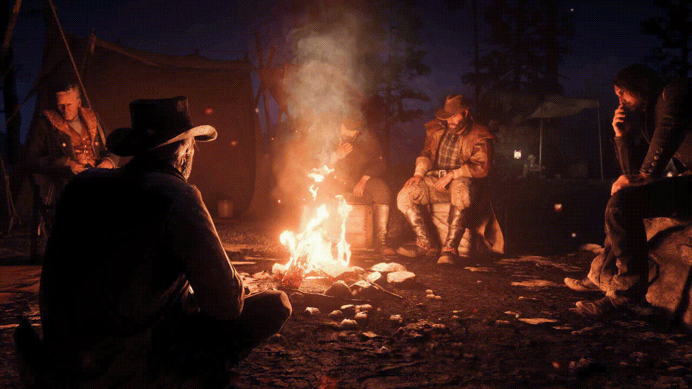

# [2024.1] Red Dead Redemption II
<div align="center">
    
    <p> Figura 1: Logo de Red Dead Redemption II.</p> 
</div>

## Sobre

<div style='text-align: justify;'>

Este repositório pertence à turma de Sistemas de Banco de Dados 1 (SBD1) do prof. Maurício Serrano, cujo propósito é desenvolver uma adaptação para MUD do jogo **Red Dead Redemption 2**, como foco no projeto e implementação do banco de dados.

Red Dead Redemption 2 é um jogo de ação e aventura em mundo aberto desenvolvido pela Rockstar Games. O jogo se passa em 1899, no final da era do Velho Oeste, e segue a história do fora-da-lei Arthur Morgan, membro da gangue Van der Linde. O jogo apresenta um mundo vasto e detalhado, com diversas cidades, vilarejos, florestas e montanhas para explorar. Os jogadores podem montar a cavalo, roubar trens, assaltar bancos e interagir com personagens não jogáveis para ganhar dinheiro e melhorar seu equipamento. O jogo também possui um sistema de honra, no qual as ações do jogador afetam sua reputação e como outros personagens reagem a ele.

</div>

## Tecnologias Utilizadas


## Como rodar

Primeiramente, certifique-se que você possui Git, Python, Docker e Docker-Compose devidamente instalados na sua máquina.

Clone o repositório com o comando
```bash
git clone git@github.com:SBD1/2024.1-Red_Dead_Redemption2.git
```

Suba os containers docker através do docker-compose:
```bash
docker-compose up -d --build
```
Em seguida, acesse o container do python
```bash
docker exec -it red-dead-game bash
```

Uma vez dentro do container, basta executar a main:
```bash
python3 main.py
```
Após ter terminado, saia do container através do comando
```bash
exit
```
E pare os containers com
```bash
docker-compose down
```

## Autores

<div align="center">
   <table style="margin-left: auto; margin-right: auto;">
        <tr>
            <td align="center">
                <a href="https://github.com/gitbmvb">
                    
                    <h5 class="text-center">Bruno Martins Valério Bomfim <br>211039297</h5>
                </a>
            </td>
            <td align="center">
                <a href="https://github.com/diogjunior100">
                    
                    <h5 class="text-center">Diógenes Dantas Lélis Jr. <br>190105267</h5>
                </a>
            </td>
            <td align="center">
                <a href="https://github.com/izarias">
                    
                    <h5 class="text-center">Pedro Augusto Dourado Izarias <br>200062620</h5>
                </a>
            </td>
    </table>
</div>

## Entrega 1 (22/07/2024)
    
[Diagrama Entidade-Relacionamento](docs/MER.md)
    
[Modelo Relacional](docs/MREL.md)

[Dicionário de Dados](docs/dicionario_dados.md)

[Apresentação](https://youtu.be/TF5FpWGe7o4)

## Entrega 2 (19/08/2024)

[DDL](src/sql/DDL.sql)

[DML](src/sql/DML.sql)

[DQL](src/sql/DQL.sql)

[Script inicial - Andar entre cidades](docs/instrucoes.md)

[Apresentação](https://youtu.be/ORvEm5pqcHw)

**Obs.:** A versão atualizada da documentação do projeto (DER, MREL, e Dicionário de Dados) pode ser acessada nos mesmos links da entrega anterior. Lá, também publicadas as versões anteriores desses documentos, a fim de comparação, caso seja necessário.